Reinforcement Learning
======================

Reinforcing Your Learning of Reinforcement Learning.

这个是我在学习强化学习的过程中的一些记录，以及写的一些代码。建立这个Github项目主要是可以和大家一起相互学习和交流，也同时方便其他人寻找强化学习方面的资料。我为什么学习强化学习，主要是想把 AlphaZero 的那套方法（结合深度学习的蒙特卡洛树搜索）用在 RNA 分子结构预测上，目前已经做了一些尝试，但没有很好的结果。

首先看的书是 Richard S. Sutton 和 Andrew G. Barto 的 [Reinforcement Learning: An Introduction (Second edition)](http://incompleteideas.net/book/bookdraft2017nov5.pdf)。

看书的同时，也根据网上的一些文章写一些简单的代码，依次如下。


Table of contents
=================

* [Q-Learning](#q-Learning)
	* [Frozen Lake Game](#frozen-lake-game)
	* [Tic Tac Toe](#tic-tac-toe)
	* [Taxi v2](#taxi-v2)
* [Deep Q-Learning Network (DQN)](#deep-q-Learning-network)
	* [Doom Game](#doom-game)
	* [Atari Space Invaders](#atari-space-invaders)
* [Policy Gradients (PG)](#policy-gradients)
	* [CartPole Game](#cartPole-game)
	* [Doom Deathmatch](#doom-deathmatch)
* [Advantage Actor Critic (A2C)](#advantage-actor-critic)
* [Asynchronous Advantage Actor Critic (A3C)](#asynchronous-advantage-actor-critic)
* [Proximal Policy Optimization (PPO)](#proximal-policy-optimization)
* [AlphaGoZero Introduction](#alphagozero-introduction)
* [Monte Carlo Tree Search (MCTS)](#monte-carlo-tree-search)
	* [Gomoku](#gomoku)
* [AlphaGomoku](#alphagomoku)


Q-Learning
==========

**Bellman equation:**
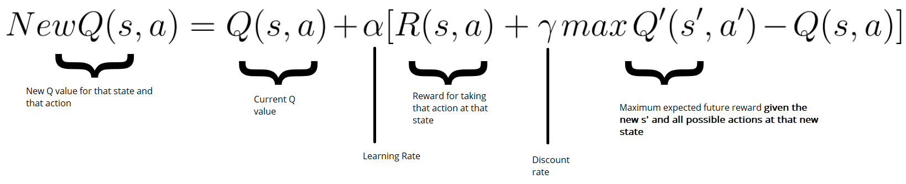

Frozen Lake Game
----------------

<div align=center>
	
</div>

基于 `Q-Learning` 玩 `Frozen Lake` 游戏：[[code]](QLearning/QLearning_FrozenLake.py)


Tic Tac Toe
-----------

<div align=center>
	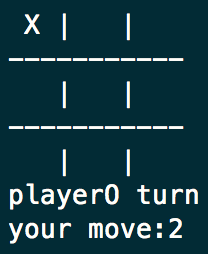
	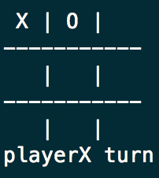
	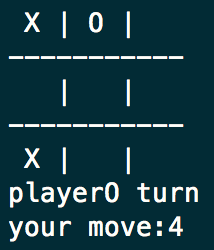
	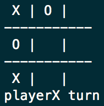
	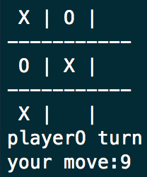
	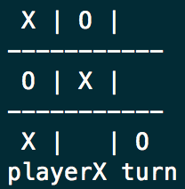
	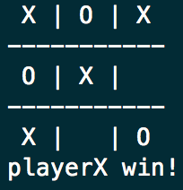
</div>

基于 `Q-Learning` 玩井字棋游戏：[[code]](QLearning/QLearning_TicTacToe.py)

训练结果：
```
Q-Learning Player vs Q-Learning Player
====================
Train result - 100000 episodes
Q-Learning win rate: 0.45383
Q-Learning win rate: 0.3527
players draw rate: 0.19347
====================

Q-Learning Player vs Random Player
====================
Train result - 100000 episodes
Q-Learning win rate: 0.874
Random win rate: 0.03072
players draw rate: 0.09528
====================
```


Taxi v2
-------

<div align=center>
	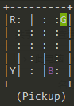
	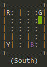
	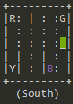
	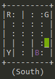
	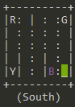
	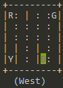
</div>

基于 `Q-Learning` 玩 `Taxi v2` 游戏：[[code]](QLearning/QLearning_Taxi_v2.py)


[0]. [Diving deeper into Reinforcement Learning with Q-Learning](https://medium.freecodecamp.org/diving-deeper-into-reinforcement-learning-with-q-learning-c18d0db58efe)<br/>
[1]. [Q* Learning with FrozenLake - Notebook](https://github.com/simoninithomas/Deep_reinforcement_learning_Course/blob/master/Q%20learning/Q%20Learning%20with%20FrozenLake.ipynb)<br/>
[2]. [Q* Learning with OpenAI Taxi-v2 - Notebook](https://github.com/simoninithomas/Deep_reinforcement_learning_Course/blob/master/Q%20learning/Taxi-v2/Q%20Learning%20with%20OpenAI%20Taxi-v2%20video%20version.ipynb)

Deep Q-Learning Network
=======================

<div align=center>
	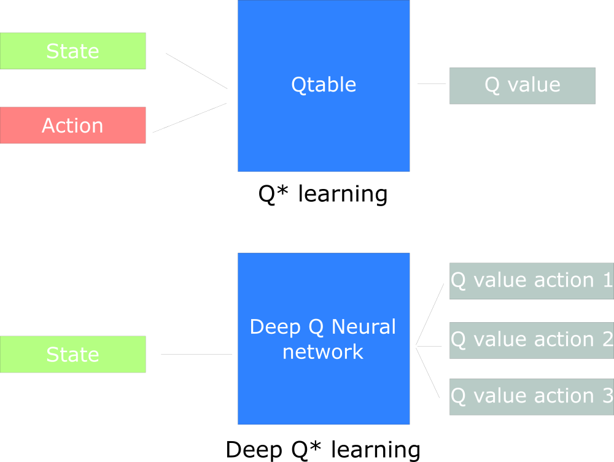
</div>


**weights updation:**

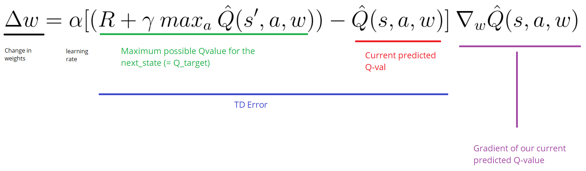

Doom Game
---------

<div align=center>
	
</div>

游戏环境这里使用的是 [ViZDoom](http://vizdoom.cs.put.edu.pl) ，神经网络是三层的卷积网络。[[code]](DQN/Doom/DQN_Doom.py)

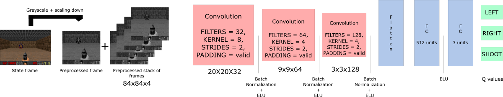

训练大约 1200 轮后结果如下：

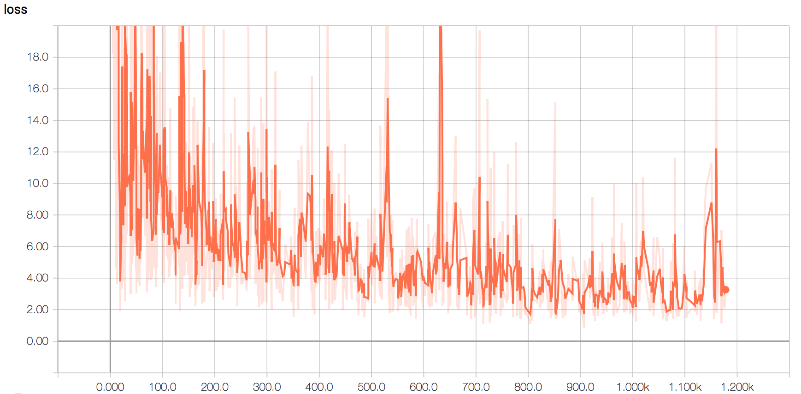

```
Episode 0 Score: 61.0
Episode 1 Score: 68.0
Episode 2 Score: 51.0
Episode 3 Score: 62.0
Episode 4 Score: 56.0
Episode 5 Score: 33.0
Episode 6 Score: 86.0
Episode 7 Score: 57.0
Episode 8 Score: 88.0
Episode 9 Score: 61.0
[*] Average Score: 62.3
```


Atari Space Invaders
--------------------

<div align=center>
	
</div>

游戏环境使用的是 [Gym Retro](https://github.com/openai/retro) ，神经网络见下图。[[code]](DQN/Atari_Space_Invaders/DQN_Atari_Space_Invaders.py)


训练大约 25 局后结果如下：

```
[*] Episode: 11, total reward: 120.0, explore p: 0.7587, train loss: 0.0127
[*] Episode: 12, total reward: 80.0, explore p: 0.7495, train loss: 0.0194
[*] Episode: 13, total reward: 110.0, explore p: 0.7409, train loss: 0.0037
[*] Episode: 14, total reward: 410.0, explore p: 0.7233, train loss: 0.0004
[*] Episode: 15, total reward: 240.0, explore p: 0.7019, train loss: 0.0223
[*] Episode: 16, total reward: 230.0, explore p: 0.6813, train loss: 0.0535
[*] Episode: 17, total reward: 315.0, explore p: 0.6606, train loss: 9.7144
[*] Episode: 18, total reward: 140.0, explore p: 0.6455, train loss: 0.0022
[*] Episode: 19, total reward: 310.0, explore p: 0.6266, train loss: 1.5386
[*] Episode: 20, total reward: 200.0, explore p: 0.6114, train loss: 1.5545
[*] Episode: 21, total reward: 65.0, explore p: 0.6044, train loss: 0.0042
[*] Episode: 22, total reward: 210.0, explore p: 0.5895, train loss: 0.0161
[*] Episode: 23, total reward: 155.0, explore p: 0.5778, train loss: 0.0006
[*] Episode: 24, total reward: 105.0, explore p: 0.5665, train loss: 0.0016
[*] Episode: 25, total reward: 425.0, explore p: 0.5505, train loss: 0.0063
```


[0]. [An introduction to Deep Q-Learning: let’s play Doom](https://medium.freecodecamp.org/an-introduction-to-deep-q-learning-lets-play-doom-54d02d8017d8)<br/>
[1]. [Deep Q learning with Doom - Notebook](https://github.com/simoninithomas/Deep_reinforcement_learning_Course/blob/master/DQN%20Doom/Deep%20Q%20learning%20with%20Doom.ipynb)<br/>
[2]. [Deep Q Learning with Atari Space Invaders](https://github.com/simoninithomas/Deep_reinforcement_learning_Course/blob/master/DQN/Space%20Invaders/DQN%20Atari%20Space%20Invaders.ipynb)<br/>
[3]. [Atari 2600 VCS ROM Collection](http://www.atarimania.com/rom_collection_archive_atari_2600_roms.html)


Policy Gradients
================

<div align=center>
	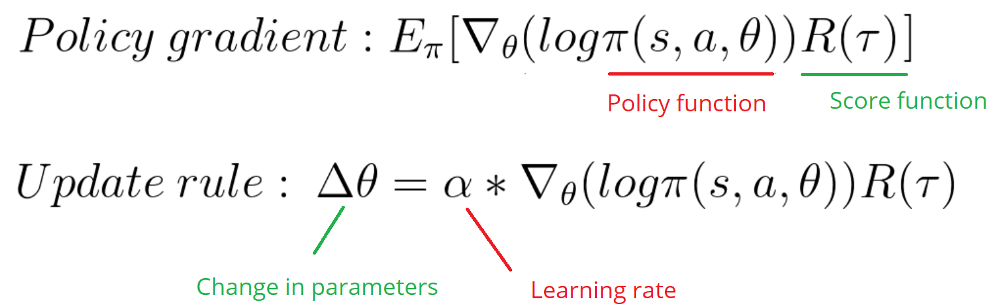
</div>

CartPole Game
-------------

<div align=center>
	
</div>

其中，Policy Gradient 神经网络如下图。[[code]](PG/Cartpole/PG_Cartpole.py)


训练大约 950 轮后结果如下：

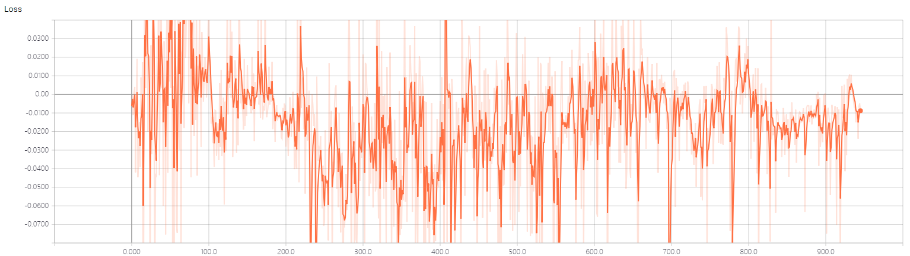
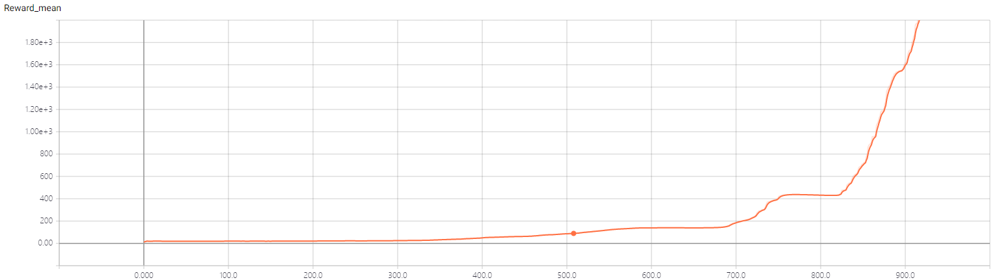

```
====================
Episode: 941
Reward: 39712.0
Mean Reward: 2246.384288747346
Max reward so far: 111837.0
====================
Episode: 942
Reward: 9417.0
Mean Reward: 2253.9883351007425
Max reward so far: 111837.0
====================
Episode: 943
Reward: 109958.0
Mean Reward: 2368.08156779661
Max reward so far: 111837.0
====================
Episode: 944
Reward: 73285.0
Mean Reward: 2443.125925925926
Max reward so far: 111837.0
====================
Episode: 945
Reward: 40370.0
Mean Reward: 2483.217758985201
Max reward so far: 111837.0
[*] Model Saved: ./model/model.ckpt
```


Doom Deathmatch
---------------

<div align=center>
	
</div>

神经网络如下图。[[code]](PG/Doom-Deathmatch/PG_Doom_Deathmatch.py)


训练 5000 局后结果如下：


```

```

[to be done]


[0]. [An introduction to Policy Gradients with Cartpole and Doom](https://medium.freecodecamp.org/an-introduction-to-policy-gradients-with-cartpole-and-doom-495b5ef2207f)<br/>
[1]. [Cartpole: REINFORCE Monte Carlo Policy Gradients - Notebook](https://github.com/simoninithomas/Deep_reinforcement_learning_Course/blob/master/Policy%20Gradients/Cartpole/Cartpole%20REINFORCE%20Monte%20Carlo%20Policy%20Gradients.ipynb)<br/>
[2]. [Doom-Deathmatch: REINFORCE Monte Carlo Policy gradients - Notebook](https://github.com/simoninithomas/Deep_reinforcement_learning_Course/blob/master/Policy%20Gradients/Doom%20Deathmatch/Doom-deathmatch%20REINFORCE%20Monte%20Carlo%20Policy%20gradients.ipynb)<br/>
[3]. [Deep Reinforcement Learning: Pong from Pixels](http://karpathy.github.io/2016/05/31/rl/)


Advantage Actor Critic
======================
[to be done]


Asynchronous Advantage Actor Critic
===================================
[to be done]


Proximal Policy Optimization
============================
[to be done]


AlphaGoZero Introduction
========================

这个是我通过阅读 AlphaGo Zero 的文献，以及结合网路上相关的一些文章，将这些内容通过自己的理解整合到这一个PPT中，用来在组会上简单的介绍 AlphaGo Zero 背后的方法和原理给同学和老师，同时也思考如何将其结合到其他领域。当然，其中也不仅仅包括 AlphaGo Zero 的内容，也有我最近看的另外一篇文章，他们的研究团队运用类似的方法来解魔方。[[pdf]](AlphaGoZero_Intruduction/alphago_zero_introduction.pdf)

<div align=center>
	
	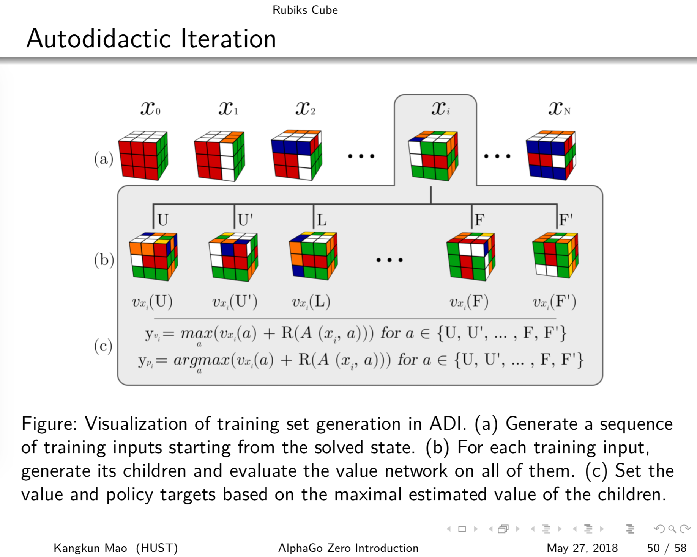
</div>

[0]. [AlphaGo Zero - How and Why it Works](http://tim.hibal.org/blog/alpha-zero-how-and-why-it-works/)<br/>
[1]. [Alpha Go Zero Cheat Sheet](https://applied-data.science/static/main/res/alpha_go_zero_cheat_sheet.png)<br/>
[2]. [Mastering the game of Go with deep neural networks and tree search](https://deepmind.com/research/publications/mastering-game-go-deep-neural-networks-tree-search/)<br/>
[3]. [Mastering the game of Go without Human Knowledge](https://deepmind.com/research/publications/mastering-game-go-without-human-knowledge/)


Monte Carlo Tree Search
=======================

Gomoku
------

<div align=center>
	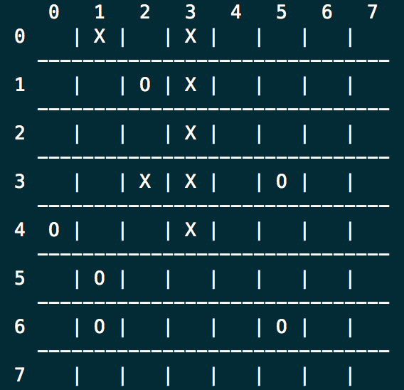
</div>

MCTS vs Random Player [[code]](MCTS/MCTS_Gomoku.py). Another MCTS on Tic Tac Toe [[code]](MCTS/MCTS_TicTacToe.py).

[0]. [mcts.ai](http://mcts.ai/code/python.html)<br/>
[1]. [Introduction to Monte Carlo Tree Search](https://www.caktusgroup.com/blog/2015/09/24/introduction-monte-carlo-tree-search-1/)


AlphaGomoku
===========

使用AlphaGo Zero的方法实现的一个五子棋AI。

下图是自我博弈训练 3000 局棋后，与人类选手对局的结果，已经很难下赢了。

<div align=center>
	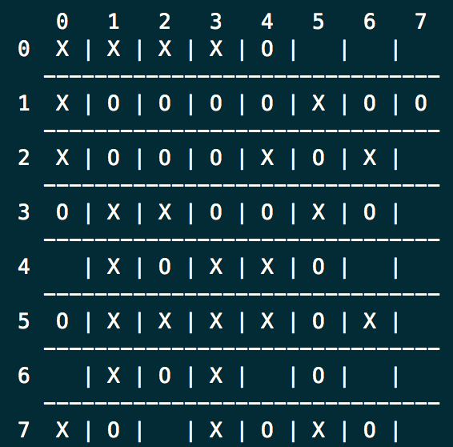
</div>

策略估值网络提供了两个模型，分别是：
```
################
# Residual_CNN #
################

Network Diagram:
                |-----------------------|                  /---C---B---R---F---D---R---D---T [value head]
I---C---B---R---o---C---B---R---C---B---M---R--- ..... ---|
    \_______/     \_______________________/                \---C---B---R---F---D---S [polich head]
   [Conv layer]       [Residual layer]

I - input
B - BatchNormalization
R - Rectifier non-linearity, LeakyReLU
T - tanh
C - Conv2D
F - Flatten
D - Dense
M - merge, add
S - Softmax
O - output

##############
# Simple_CNN #
##############

Network Diagram:
                                               2(1x1)       64     1
    32(3x3)     64(3x3)    128(3x3)        /-----C-----F-----D-----D-----T  [value head]
I-----C-----R-----C-----R-----C-----R-----|
      \_____________________________/      \-----C-----F-----D-----S        [polich head]
           [Convolutional layer]               4(1x1)       w^2

I - input
B - BatchNormalization
R - ReLU
T - tanh
C - Conv2D
F - Flatten
D - Dense
S - Softmax
```

`8x8` 大小棋盘自我博弈训练 3000 局的结果如下：

<div align=center>
	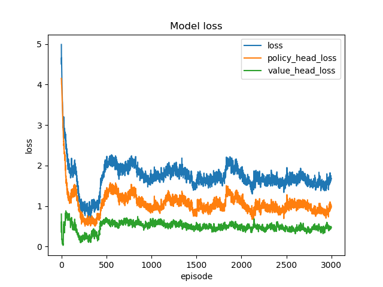
</div>

```
[*] Episode: 2991, length: 42, start: O, winner: X, data: 336, time: 85s, win ratio: X 48.1%, O 48.5%, - 3.4%
Epoch 1/1
512/512 [==============================] - 1s 2ms/step - loss: 1.7491 - value_head_loss: 0.4658 - policy_head_loss: 1.0655
[*] Episode: 2992, length: 19, start: O, winner: O, data: 152, time: 40s, win ratio: X 48.1%, O 48.5%, - 3.4%
Epoch 1/1
512/512 [==============================] - 1s 2ms/step - loss: 1.6507 - value_head_loss: 0.4631 - policy_head_loss: 0.9698
[*] Episode: 2993, length: 23, start: X, winner: X, data: 184, time: 47s, win ratio: X 48.1%, O 48.5%, - 3.4%
Epoch 1/1
512/512 [==============================] - 1s 2ms/step - loss: 1.6409 - value_head_loss: 0.4322 - policy_head_loss: 0.9908
[*] Episode: 2994, length: 35, start: X, winner: X, data: 280, time: 71s, win ratio: X 48.1%, O 48.5%, - 3.4%
Epoch 1/1
512/512 [==============================] - 1s 2ms/step - loss: 1.6128 - value_head_loss: 0.4528 - policy_head_loss: 0.9421
[*] Episode: 2995, length: 16, start: X, winner: O, data: 128, time: 35s, win ratio: X 48.1%, O 48.5%, - 3.4%
Epoch 1/1
512/512 [==============================] - 1s 2ms/step - loss: 1.7529 - value_head_loss: 0.4884 - policy_head_loss: 1.0466
[*] Episode: 2996, length: 22, start: O, winner: X, data: 176, time: 46s, win ratio: X 48.1%, O 48.5%, - 3.4%
Epoch 1/1
512/512 [==============================] - 1s 2ms/step - loss: 1.6800 - value_head_loss: 0.4583 - policy_head_loss: 1.0038
[*] Episode: 2997, length: 16, start: X, winner: O, data: 128, time: 35s, win ratio: X 48.1%, O 48.5%, - 3.4%
Epoch 1/1
512/512 [==============================] - 1s 2ms/step - loss: 1.6877 - value_head_loss: 0.4973 - policy_head_loss: 0.9725
[*] Episode: 2998, length: 22, start: X, winner: O, data: 176, time: 48s, win ratio: X 48.1%, O 48.5%, - 3.4%
Epoch 1/1
512/512 [==============================] - 1s 2ms/step - loss: 1.6530 - value_head_loss: 0.4887 - policy_head_loss: 0.9464
[*] Episode: 2999, length: 16, start: X, winner: O, data: 128, time: 33s, win ratio: X 48.1%, O 48.5%, - 3.4%
Epoch 1/1
512/512 [==============================] - 1s 2ms/step - loss: 1.6951 - value_head_loss: 0.4582 - policy_head_loss: 1.0189
[*] Episode: 3000, length: 9, start: X, winner: X, data: 72, time: 18s, win ratio: X 48.1%, O 48.5%, - 3.4%
Epoch 1/1
512/512 [==============================] - 1s 2ms/step - loss: 1.6760 - value_head_loss: 0.4743 - policy_head_loss: 0.9838
```

具体代码及训练好的模型参数请参考这里：[[code]](AlphaGomoku/)


[0]. [How to build your own AlphaZero AI using Python and Keras](https://applied-data.science/blog/how-to-build-your-own-alphazero-ai-using-python-and-keras/)<br/>
[1]. [Github: AppliedDataSciencePartners/DeepReinforcementLearning](https://github.com/AppliedDataSciencePartners/DeepReinforcementLearning)<br/>
[2]. [Github: Rochester-NRT/RocAlphaGo](https://github.com/Rochester-NRT/RocAlphaGo)<br/>
[3]. [28 天自制你的 AlphaGo (6) : 蒙特卡洛树搜索（MCTS）基础](https://zhuanlan.zhihu.com/p/25345778)<br/>
[4]. [AlphaZero实战：从零学下五子棋（附代码）](https://zhuanlan.zhihu.com/p/32089487)<br/>
[5]. [Github: junxiaosong/AlphaZero_Gomoku](https://github.com/junxiaosong/AlphaZero_Gomoku)
