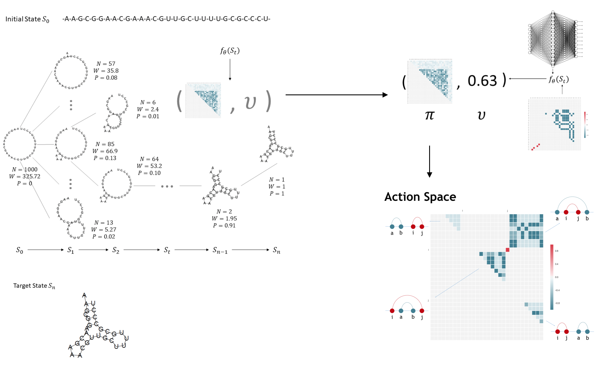
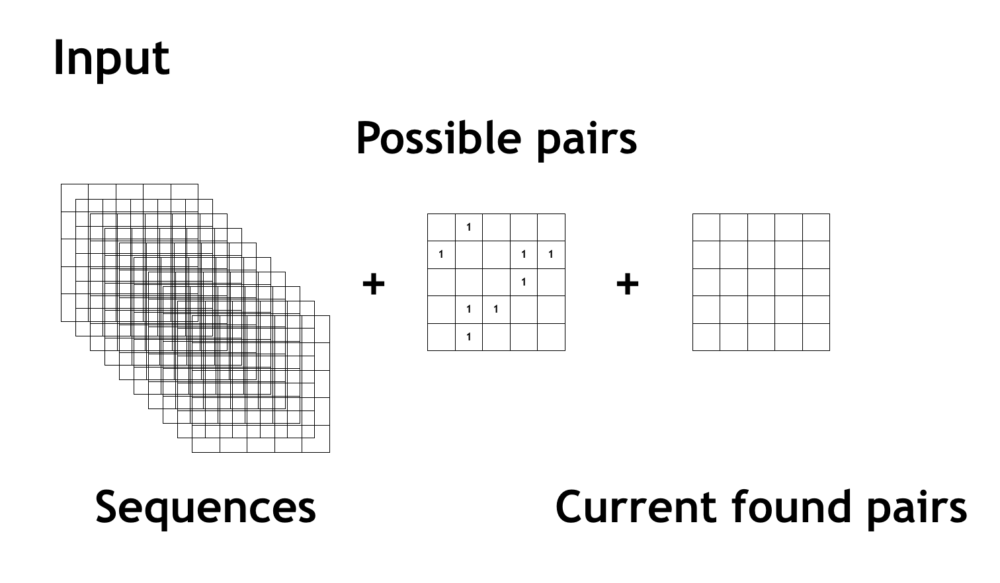
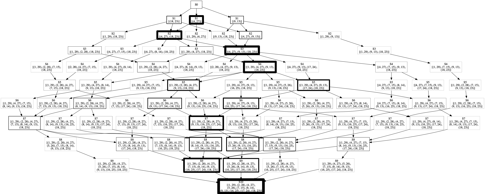
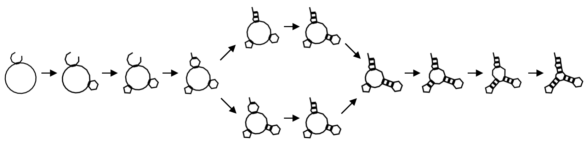

Learning RNA Secondary Structure Folding Path with Deep Reinforcemen Learning
================================================================================

使用深度强化学习来学习 RNA 分子的二级结构折叠路径。

Table of contents
=================

* [Abstract](#abstract)
	* [Method](#method)
	* [Result](#result)
  * [Usage](#usage)


Abstract
========

Method
------

I use Asynchronous Advantage Actor Critic (A3C), one of the most popular reinforcement learning method, combined with Monte Carlo Tree Search (MCTS), to find out the RNA molecule folding path of secondary structure. The neural network which we used is a simple three convolutional layer with two output head that give current RNA state energy and the probabilities of next pairing action. The fellow diagram illustrates the whole pipeline.



```
 Network Diagram:
                                               2(1x1)       64     1
    32(3x3)     64(3x3)    128(3x3)        /-----C-----F-----D-----D-----R  [value head]
I-----C-----R-----C-----R-----C-----R-----|
      \_____________________________/      \-----C-----F-----D-----S        [polich head]
           [Convolutional layer]               4(1x1)       w^2

I - input
R - ReLU
C - Conv2D
F - Flatten
D - Dense
S - Softmax
```



Result
------

After learning 720 folding path episodes of one small RNA (30nt), I find 50 succeed folding paths to the true native secondary structure. Through analyzing those paths we can understand how RNA fold to the native structure (shown as the figure).





train log:

```
[*] Episode: 715, length: 8, final energy: 20.0, data: 64, time: 339s
    find pairs: [(9, 19), (4, 27), (6, 21), (1, 29), (2, 28), (5, 26), (13, 17), (7, 20)]
Epoch 1/1
512/512 [==============================] - 19s 38ms/step - loss: 3.1404 - value_head_loss: 0.0317 - policy_head_loss: 2.9776
[*] Episode: 716, length: 7, final energy: 18.0, data: 56, time: 297s
    find pairs: [(4, 8), (18, 23), (9, 13), (1, 29), (17, 26), (2, 28), (3, 14)]
Epoch 1/1
512/512 [==============================] - 20s 38ms/step - loss: 3.0928 - value_head_loss: 0.0288 - policy_head_loss: 2.9298
[*] Episode: 717, length: 9, final energy: 14.0, data: 72, time: 379s
    find pairs: [(5, 18), (4, 27), (9, 13), (1, 29), (2, 28), (8, 14), (7, 15), (21, 25), (6, 16)]
Epoch 1/1
512/512 [==============================] - 21s 42ms/step - loss: 3.1896 - value_head_loss: 0.0439 - policy_head_loss: 3.0122
[*] Episode: 718, length: 10, final energy: 4.0, data: 80, time: 393s
    find pairs: [(4, 27), (6, 16), (9, 13), (18, 23), (1, 29), (5, 26), (2, 28), (17, 24), (8, 14), (7, 15)]
Epoch 1/1
512/512 [==============================] - 16s 31ms/step - loss: 3.0923 - value_head_loss: 0.0226 - policy_head_loss: 2.9370
[*] Episode: 719, length: 8, final energy: 20.0, data: 64, time: 299s
    find pairs: [(4, 27), (12, 21), (1, 29), (2, 28), (5, 26), (8, 23), (11, 22), (13, 17)]
Epoch 1/1
512/512 [==============================] - 18s 35ms/step - loss: 3.0789 - value_head_loss: 0.0203 - policy_head_loss: 2.9242
[*] Episode: 720, length: 10, final energy: 0.0, data: 80, time: 360s
    find pairs: [(4, 27), (18, 23), (9, 13), (1, 29), (17, 24), (16, 25), (2, 28), (5, 26), (8, 14), (7, 15)]
Epoch 1/1
512/512 [==============================] - 17s 32ms/step - loss: 3.0490 - value_head_loss: 0.0140 - policy_head_loss: 2.9012
```

Usage
-----

> The following instructions guides you to get the folding path of your target RNA molecule.

First configurate your RNA data and other train settings in `rna_folding.py` file:

```
#======================
# Configuration
#======================
rna_data = {
    'id': 'None',
    'len': 30,
    'seq': 'AAGCGGAACGAAACGUUGCUUUUGCGCCCU',
    'pairs': [
        (1, 29), (2, 28), (4, 27), (5, 26), (7, 15),
        (8, 14), (9, 13), (16, 25), (17, 24), (18, 23)
    ],
    'sec': '.((.((.(((...)))(((....)))))))'
}
train_episode_num = 1000
train_batch_size = 512
train_epochs = 1
train_check_step = 10
train_data_buffer_size = 10000
mcts_playout_itermax_train = 2000
model_file = 'Simple_CNN'
policy_network = Simple_CNN
#======================
```

Train the network & record the log:

```
python rna_folding.py --train | tee train.log
```

Find all the succeed folding paths to the true native secondary structure, and use `results/convert_folding_path_results_to_dot_file.py` to convert those paths to `.dot` file, then you can use `graphviz` to view the folding path tree:

```
dot -Tpng xxx.dot -o xxx.png
```
